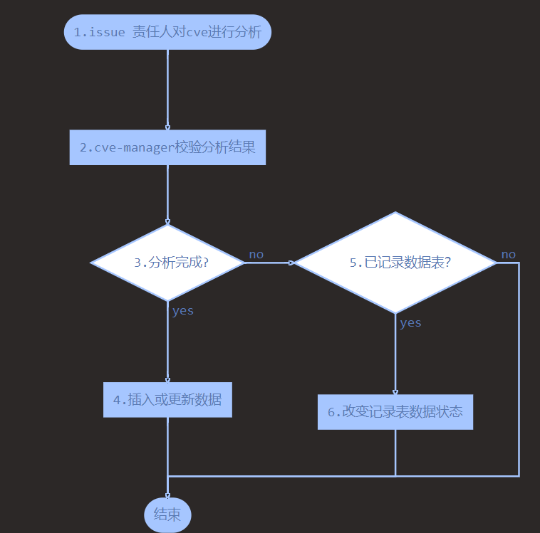
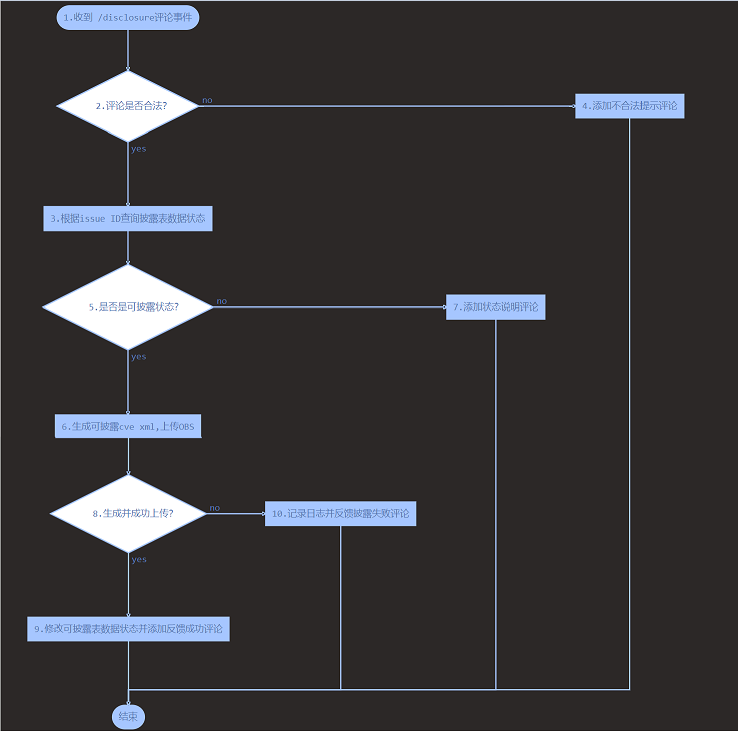

## CVE 提前披露方案

### 需求描述

在gitee 平台对 CVE issue 分析完成后，支持使用命令生成 CVE 文件，该文件支持导入CVE 官网公告平台。 

### 解决方案

#### 1. cve-manager 每天定时整理已分析完成的  CVE 并发送邮件告知安全委员会成员

**披露数据表**

|  字段名 | 描述  | 值 |
| ------------ | ------------ | ------------ |
| id  | 主键  | 自增 int类型  |
| issue_url  | gitee issue 路径  | string  |
| issue_title | gitee issue title | string |
| issue_id | gitee issue ID | int |
| disclosure_status | 披露状态 | 0 可披露未发送email <br> 1 已发送Email未生成xml<br> 2 已生成xml未发布官网<br> 3 已经披露到官网<br> 4 已生成安全公告<br> -1 issue 未分析完成   |
| disclosure_xml_path | cve xml文件在obs上的下载路径 | string |
| disclosure_xml_MD5 | cve  xml 文件MD5值 | string |
   
**issue 分析完记录可披露CVE流程图**

```flow
st=>start: 1.issue 责任人对cve进行分析
op=>operation: 2.cve-manager校验分析结果
cond=>condition: 3.分析完成?
oprec=>operation: 4.插入或更新数据
condh=>condition: 5.已记录数据表？
ophr=>operation: 6.改变记录表数据状态
e=>end: 结束

st->op->cond
cond(yes)->oprec
cond(no)->condh
oprec->e
condh(yes)->ophr->e
condh(no)->e
```



流程图步骤说明：

- 步骤1，2，3：可复用先有功能，在webhook处理函数追加处理逻辑;
- 步骤4：根据issue ID 查询数据表，存在记录则修改状态为0，否则插入新的数据，且披露状态为0;
- 步骤6：在issue重新回到未分析完成的状态，需更改披露状态为-1;

**cve-manager 发送可提前披露的cve-issue邮件到安全委员会成员邮箱**

- 每日9:00 根据披露表生数据生成可提前披露的cve issue邮件内容并发送给每个安全委员会成员邮箱
- 发送完成后修改数据表披露状态为1

#### 2. cve-manager 提供 `/disclosure` 指令，安全委员成员在收到邮件后，在对应CVE issue 评论中使用该指令触发生成提前披露的CVE文件并上传OBS；

**披露指令设计**

|  指令 | 描述  | 使用条件  |
| ------------ | ------------ | ------------ |
| /disclosure  | 生成提前披露的cve xml 文件  |  必须满足以下所有条件：<br> 1.使用指令的人是安全委员会成员；<br> 2. issue 已分析完成 |

**披露指令响应流程图**

```flow
st=>start: 1.收到 /disclosure评论事件
cond=>condition: 2.评论是否合法？
opvli=>operation: 3.根据issue ID查询披露表数据状态
opuvli=>operation: 4.添加不合法提示评论
conds=>condition: 5.是否是可披露状态？
opy=>operation: 6.生成可披露cve xml,上传OBS
opuy=>operation: 7.添加状态说明评论
condup=>condition: 8.生成并成功上传？
opupy=>operation: 9.修改可披露表数据状态并添加反馈成功评论
opupn=>operation: 10.记录日志并反馈披露失败评论
e=>end: 结束

st->cond
cond(yes)->opvli
cond(no)->opuvli->e
opvli->conds
conds(yes)->opy
conds(no)->opuy->e
opy->condup
condup(yes)->opupy->e
condup(no)->opupn->e
```



流程图步骤说明：

- 步骤1：在接收到评论webhook回调时判断是否是披露指令;
- 步骤2：根据指令使用条件判断是否合法
- 步骤4：添加不合法评论
  评论内容：`@评论人 您没有权限使用/disclosure` 或 `@评论人 该issue未分析完成不能提前披露`
- 步骤5：披露状态是否为 0或1 
- 步骤6：生成文件名为 disclosure-cve-`issue_id`.xml文件并上传至指定的OBS桶中。
- 步骤7：根据披露状态在issue上添加给评论者反馈指令使用失败的评论
  如：`@评论人 当前issue分析内容未发生变更，无需重新披露`
- 步骤9：上传到OBS成功，更新披露数据表披露状态为2，且记录xml文件在OBS上的路径以及文件的MD5值，并在issue上添加指令使用成功的评论；
- 步骤10：上传失败，记录日志并在issue上添加指令执行失败的评论；
  `@评论人 cve提前披露失败，请使用指令重试`


#### 3.  SA 服务提供手动触发和定时任务两种方式将CVE文件导入官网；

**cve-manager提供获取可提前披露的xml文件API**

路由：/v1/disclosure/cves
方法：get
参数：

|  参数名 | 描述  | 类型  |
| ------------ | ------------ | ------------ |
| page  | 页码  |  int |
| size  | 每页数量 | int  |


返回值：

```json
{
  "total":"10",
  "page":"1",
  "size":"5",
  "cves":[
   {
   "id":1
   "issue_id":32689,
   "issue_title":"cve-2022-1689",
   "issue_url":"https://gitee.com/src-openeuler/vim/issues/ITY56S",
   "disclosure_status":2,
   "disclosure_xml_path":"/disclosure-cve/disclosure-cve-32689.xml",
   "disclosure_xml_MD5": "YYISNSHDBSHU898799YUHGGSS==",
   },
  ]
}
```

需讨论调用api后已经成功披露到官网的cve回执处理

1. cve-manager 提供接口给SA服务，SA服务主动告知？
2. SA 服务提供接口供cve-manager 查询？

**官网CVE页面排版调整**

**暴露手动触发在官网生成提前披露的CVE的API**

**编写定时任务触发在官网生成提前披露的CVE**


#### 4. 提前披露原有功能影响分析

1. cve是否已发布官网判断
2. 在导出安全公告时需添加清理提前披露的CVE
