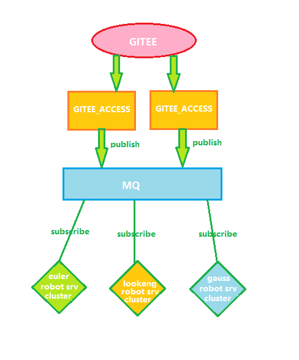
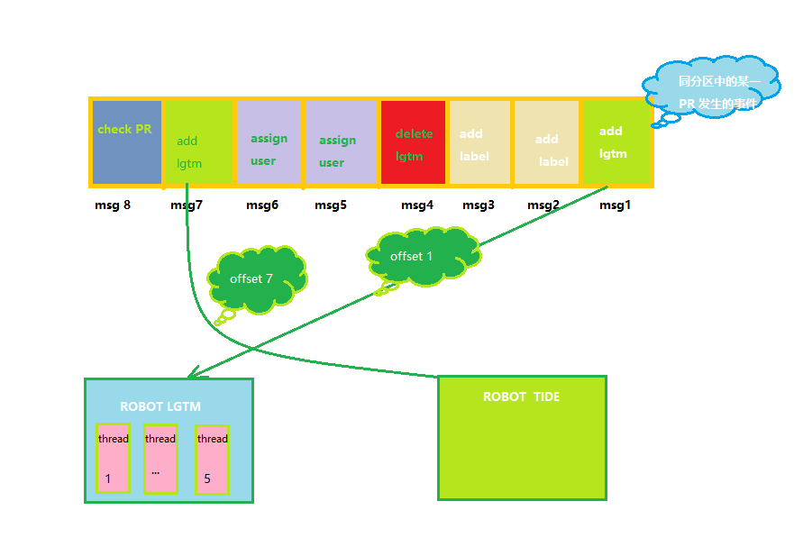
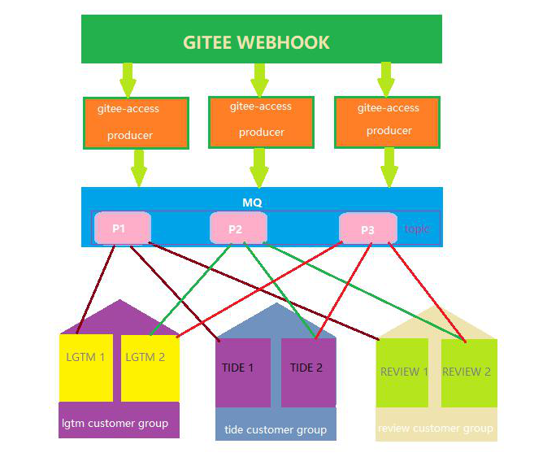
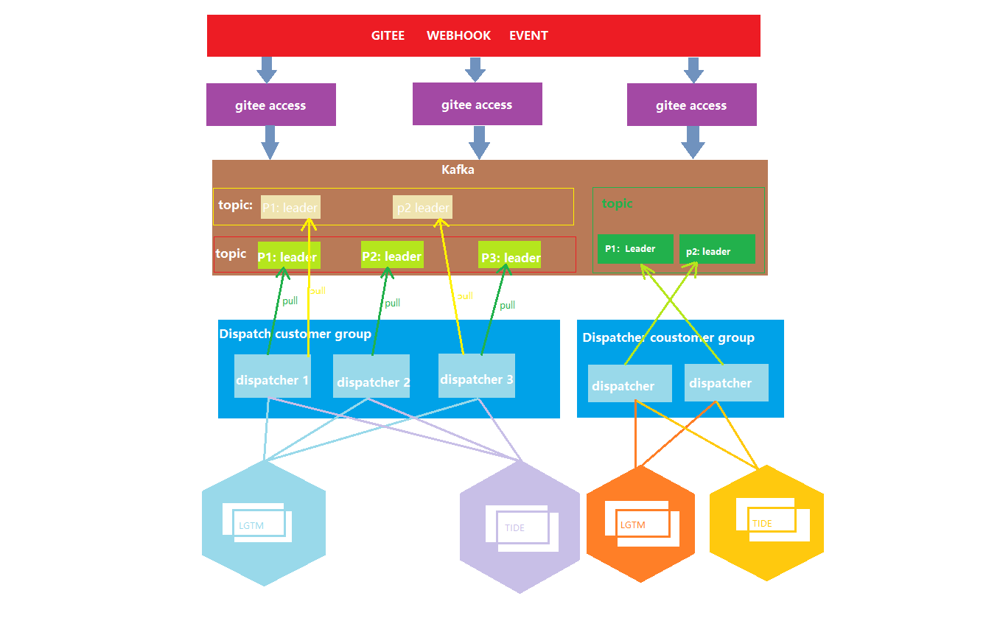
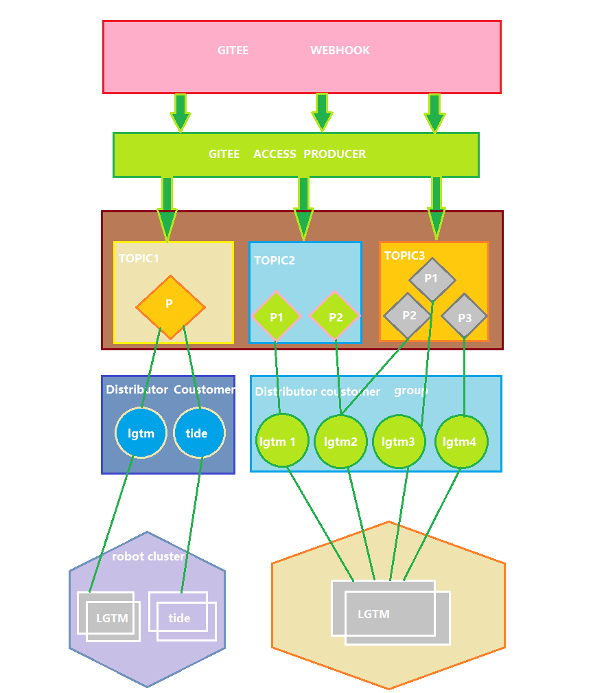
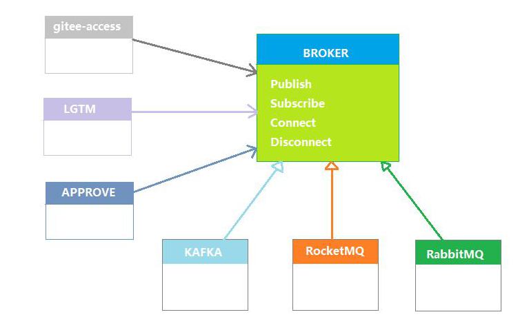

# Robot Service MQ 接入文档

### 概要

##### 当前robot 服务需优化的功能

在当前架构下gitee-access 负责webhook的接收并分发到下游所有特定功能的机器人服务：

- 当下游机器人服务数量随着业务增长，gitee-access将会成为整体架构的性能瓶颈；
- gitee-access不会记录某一事件因下游服务宕机期间不可达，会导致宕机期内下游服务关注的事件丢失，永久不可恢复；
- gitee-access 需配置它要转发的下游机器人服务的endpoint, 增加新的机器人需更新配置；

当前架构缺少监控；

- 对社区webhook流量监控
- 对错误日志的监控
- 对服务宕机的监控
- 对服务性能的监控
- 应对负载对服务pod的自动扩缩容（ps: k8s支持监控pod cpu等指标来扩缩pod）

##### 接入MQ期望

- 解开gitee-access与下游服务的转发依赖；
- 对webhook事件做缓存：
  - 缓冲webhook 事件瞬时峰值流量；
  - 下游服务宕机重启后可继续处理未处理的事件；
  - 为监控系统提供监控指标；

##### 接入MQ引入的问题

- 消息的时序保证
- 消息重复消费
- 对下游服务扩缩容的限制

##### 接入MQ后的系统架构

### 选型

##### 性能最低目标

**单社区支持10W开发者**

因目前无社区开发者触发webhook的峰值以及平均数据：假定10W开发者一天触发100W个有效 webhook事件，依照2 8原则即80%的流量在20%的时间内发生计算峰值：

> PV = 1000000
>
> 峰值TPS = (1000000 * 0.8)/(24 * 0.2*3600) = 58
>
> assign机器人在工作机上处理1000个事件最差费时17s TPS = 1000/17 = 58 因线上环境可能优于本地测试环境，则假设所有机器人平均 TPS = 40 则单社区2个pod足以支撑。

**社区事件消息消费延迟不能超过1分钟**

##### 主流分布式MQ对比：

| 维度     | kafka                                     | rocketMQ                           | ActiveMQ                           | RabbitMQ                         |
| -------- | ----------------------------------------- | ---------------------------------- | ---------------------------------- | -------------------------------- |
| 实现语言 | scala                                     | java                               | java                               | Erlang                           |
| 消息存储 | 内存、磁盘、数据库。支持大量堆积。        | 磁盘。支持大量堆积。               | 内存、磁盘、数据库。支持少量堆积。 | 内存、磁盘。支持少量堆积。       |
| 消息事务 | 支持                                      | 支持                               | 支持                               | 支持(使用事务会使得性能有所下降) |
| 负载均衡 | 支持                                      | 支持                               | 支持                               | 支持不友好                       |
| 可用性   | 非常高                                    | 非常高                             | 高                                 | 高                               |
| TPS      | 极大                                      | 大                                 | 比较大                             | 比较大                           |
| 顺序消息 | 支持(Kafka保证同一个分区里的消息是有序的) | 支持                               | 不支持                             | 不支持                           |
| 消息确认 | 支持                                      | 支持                               | 支持                               | 支持                             |
| 消息回溯 | 支持指定分区offset位置的回溯              | 支持指定时间点的回溯               | 不支持                             | 不支持                           |
| 并发度   | 高(Kafka限制消费者的个数要小于等于分区数) | 高(限制消费者的个数少于等于队列数) | 高                                 | 极高                             |

##### 基于kafka

根据上文所示，选择kafka做为系统架构中消息中间件

因kafka 单队列并发最高可超过10万TPS，所以应该结合机器人服务TPS限制消费者拉取消息的速率，以保证消息消费不会冲垮下游服务，但是也应防止消息过多堆积导致消息消费延迟过大。

###### 讨论FAQ

**一个topic分区的上限是多少?**

> Kafka以分区为粒度管理消息，分区多导致生产、存储、消费都碎片化，影响性能稳定性。在使用过程中，当Topic的总分区数达到上限后，用户就无法继续创建Topic。不同规格配置的Topic总分区数不同，具体请参考[Kafka产品规格说明](https://support.huaweicloud.com/productdesc-kafka/Kafka-specification.html)。

> [Apache Kafka支持单集群20万分区](https://www.cnblogs.com/huxi2b/p/9984523.html)]

**保证消息的顺序有无必要?**

有必要，随机写入多个分区将会放大消息乱序的出现几率从而影响功能的正确性。

> 假定有两个分区管理一个社区的所有事件，有一个PR 发生两个事件，顺序为添加LGTM 标签，删除LGTM标签；此时A分区有10个消息等待被消费，B分区有1个消息等待被消费，添加标签事件落在A分区，删除标签事件落在B分区，则消息在下层被消费就有极大的概率先消费删除标签事件，从而造成功能的正确性，且跟踪问题和修复问题困难。

**消费者组中消费者个数与分区强耦合的情况下怎么支持消费者动态扩缩容？**

依照kafka架构特性，消费关注的topic的总分区数将成为服务实例扩容的阈值，且频繁的扩缩容将影响消息消费的性能；

**自动提交是怎么做的？能实现期望拿到消息就移动offset，不用关注消息的业务逻辑处理结果吗？**

自动提交即可以设置消费者间隔多少时间周期性的自动提交offset，业务代码无需关心offset的提交。手动提交可以以更大的自由度提交offset，比如可以在消息分发完成后就提交offset，也可以在这一批次消息分发下去等消息相关的业务逻辑执行完成再提交。

**消息批次处理会导致两个时间间隔较大且消息执行结果相关联的逻辑出现逻辑错乱吗？**

机器人服务的业务场景中接入MQ出现消息积压以及消息的乱序执行会放大该问题的出现可能，假设如下图场景所示：

- 同一机器人服务内消息有堆积的场景

  > lgtm 机器人一次从分区中消费5条消息且并发执行，则存在msg4优先于msg1执行的情况，导致最终结果为PR上存在LGTM标签
  >
  > 解决方法：控制并发粒度(比如以org/repo/PR/number:eventType为粒度)，消息串行执行，增加逻辑的复杂度以及降低系统的吞吐量来保证消息的时序性以确保逻辑正确执行。
  >
- 不同机器人服务逻辑存在依赖关系且LGTM机器人服务出现消息堆积，tide机器人服务无消息堆积的场景

  > 如上图所示，PR只需一个LGTM标签即可合入，tide 机器人已经可以消费最新的一条检查PR是否可以合入的消息了，而lgtm 机器人还在从第一条消息开始消费。
  >
  > 则会导致本应该合入的PR无法合入
  >
  > 解决方法：需根据具体问题具体分析去解决，对于现在出现的场景可以修改业务逻辑，不提供主动触发合入检测的指令而去监听标签变化事件触发检测PR是否可以合入。
  >

###### 总结

**生产端：**

- 由gitee-access 服务作为生产者接受webhook事件并将webhook事件写入kafka，gitee-access 可以自由伸缩，且处理逻辑简单只是接受webhook 生产消息，所以单个gitee-access服务足以支撑单社区十万开发者。
- 根据事件所属组织创建topic,如 openEuler:webhook。

  > PS：据华为云分布式消息服务Kafka文档描述，Kafka实例本身对Topic数量没有做限制，但是Topic的分区数之和有上限，当达到上限之后，用户无法继续创建Topic。所以，Topic数量和实例分区数上限、每个Topic的分区数有关，其中，每个Topic分区数可在创建Topic时设置，如[图1](https://support.huaweicloud.com/intl/zh-cn/productdesc-kafka/Kafka-specification.html#Kafka-specification__fig145861331153112)，实例分区数上限参考[表1](https://support.huaweicloud.com/intl/zh-cn/productdesc-kafka/Kafka-specification.html#Kafka-specification__table78751014154818)。
  >
- 为了保证整体系统的并发度，以及根据性能最低目标计算结果，每个topic设置3个分区。
- 为了保证消息消费的时序性，使用org/repo/[pr|issue]number:EventType作为消息的Key，并根据hash计算均匀的分布在topic的不同分区中，并保证同一PR或issue的事件在同一分区中。
- kafka能保证每条消息只被传递一次：

  > 从 0.11.0.0 版本开始，Kafka producer新增了幂等性的传递选项，该选项保证重传不会在 log 中产生重复条目。 为实现这个目的, broker 给每个 producer 都分配了一个 ID ，并且 producer 给每条被发送的消息分配了一个序列号来避免产生重复的消息。 同样也是从 0.11.0.0 版本开始, producer 新增了使用类似事务性的语义将消息发送到多个 topic partition 的功能： 也就是说，要么所有的消息都被成功的写入到了 log，要么一个都没写进去。这种语义的主要应用场景就是 Kafka topic 之间的 exactly-once 的数据传递。
  >

  > 发送方确认机制：ack=0，不管消息是否成功写入分区；ack=1，消息成功写入leader分区后，返回成功；ack=-1，消息成功写入所有分区后，返回成功。
  >

  > 也有可能会丢消息，比如在ack=-1下重试若干次后消息生产失败，这种可能性极小可以容忍。
  >

**消费端：**

- 根据kafka特性topic中的每个分区只由同组中唯一消费者消费，且消费者组中新增或删除消费者kafka会执行rebalance；在实现中应该限制消费者数量的频繁变动；
- 在新的消费者加入消费者组需获取它所消费的分区最后提交的offset，当发生再平衡分区有可能被不同的消费者消费，新的消费者也要拉取分区的offset，以避免消息被重复消费；
- 为了精确控制offset，消费者配置关闭自动提交，并在执行消费消息逻辑后手动提交offset;
- 设置消费者拉取消息的最大值，以避免过高的负载打满下游机器人服务造成服务不可用；
- 缩小机器人业务逻辑的并发粒度，做到同一PR或ISSUE同一类型的事件串行处理以保证业务逻辑的正确性；
- 从整体服务业务依赖性因依赖依赖项事件的执行结果而不是依赖事件触发的顺序；

### 方案

综上所述，有以下两种方案，不同方案对问题的容忍度不同。

#### 方案一：机器人服务即为MQ消费者

优势：

- 机器人服务直接依赖MQ，于其它（gitee access）服务无配置项以及网络请求依赖；
- 无需其它容灾方案即可防止服务宕机到重新运行过程中丢失webhook事件；
- 各服务实例负责自己所在分区的消息，消息消费粒度可控性好；
- 上线新的机器人只需关注机器人本身所关注的topic以及自身功能配置项，无需关联其它服务配置；

劣势：

- 服务实例与kafka消息分区强关联，因kafka点对点消息消费策略(即同一分区中消息同一时间只能被消费组中唯一一个消费者消费)会限制消费者实例数量(max = topic_num * partition_num)，当消费者数量超过分区数，会造成多出的服务实例饿死；
- 消费组中的服务实例不能频繁退出和加入消费组即需要保证机器人服务的稳定性，因kafka的rebalance比较耗时且会阻塞消费者组中所有的消费者。
- 当某个机器人服务消费组整体达到性能瓶颈，需增加topic分区数，或拆分topic 才能提增加服务数量才能扩大消费者数量，且kafka 要缩小分区数需先删除topic在创建topic。

处理劣势调研：

> 一般而言，kafka集群的拥有越多的分区也意味着可以获取更高的吞吐。
>
> 选择分区的数量一般可用基于吞吐来进行简单计算。
>
> 您可以在单个分区上对生产(称为p)和消费(称为c)所能实现的所有性能进行度量。假如我们的目标吞吐是 `t`，然后我们可以设置分区数量为 `max(t/p, t/c)`。
>
> 在消费者端吞吐量通常依赖于应用程序，因为它对应于使用者逻辑处理每个消息的速度，因此得实际进行测量。
>
> 尽管在topic创建后期，可以根据需求进行扩容分区，但是对于有 `keys`的消息需要注意。
>
> 因为当生产者写入一个带 `key`的消息后，kafka将依据该 `key`的hash来决定数据映射到具体的分区，这样就可以保证具有相同 `key`的消息会被路由到同一个分区，从而保证了一类消息的有序性。
>
> 如果此时分区数量突然增加，将可能导致数据的无序性，为了避免未来这种问题的出现，一般而言会在业务接入初期进行分区的过度分配 `over-partition`，即在topic创建时尽量多创建一些，但基本上在接入之前需要预估未来的吞吐量以确定一个合理的分区数量，这样即使当前集群规模较小，可以对topic进行提前规划，待后期集群规模大之后进行迁移即可，否则刚开始因为集群规模小，而对分区数量没有合理规划，后期会比较麻烦，而且这样当生产者使用带 `key`的消息时，您可以跟上吞吐量的增长，而不会破坏应用程序中的语义。

#### 方案二：在机器人服务之上加分发层

 架构图一

优势：

- 解耦机器人服务与topic分区的强关联；将方案1的劣势下沉到分发层；
- 可以快速实现服务实例的扩缩容；单一服务实例宕掉不会阻塞消息的消费；

劣势：

- 机器人服务与分发层强关联，当发布新的机器人需告知分发层；
- 增加了问题跟踪的深度；
- 因分发层消费者不是唯一分发给某一个服务实例集，当某个服务所有实例宕掉，其关注的topic的消息将丢失无法再次消费；
- 方案一的劣势将在分发层体现

架构图二：

### 思考：

- 扩缩容 kafka 重平衡对消费者性能的影响，以及扩缩容对于系统接入kafka是否是一个必选项。是否可以考虑在满足5000PR的基础上超分配一些分区来应对后续的流量增大来扩pod提升性能，只扩pod一定就能解决性能问题？
- 是否能监控性能瓶颈到达时pod的数量来动态扩分区再扩pod？扩分区时带key的消息在扩pod后可能会造成消息的乱序是否可以容忍？
- 单分区的劣势，单分区会导致所有的PR的消息都在一个分区虽然可以保证整个topic的顺序性但会对kafka以及下层的消费者并发度有影响是否可以接受？
- 消费者根据shardingkey做本地队列来保证消费顺序是否要保证消息百分之百不丢？不丢消息业务是否允许消息的重复消费？重复消费机器人业务能否保证幂等？少量的消息丢失是否可以容忍？服务宕机（软件bug，性能瓶颈），机器掉电（物理原因）等发生的概率是否很大？
- 机器人服务上线是否需要不依赖其它服务配置项的更改在接入MQ占多大权重？
- 接MQ要达到什么目的？

**kafka go 开源库**

1. [sarama](https://github.com/Shopify/sarama) : 具有完整协议支持的纯 Go 实现。包括消费者和生产者实现。
2. [confluent-kafka-go](https://github.com/confluentinc/confluent-kafka-go) : 客户端封装了 librdkafka C 库，提供完整的 Kafka 协议支持，具有出色的性能和可靠性。

### 机器人接入MQ的设想

如下图所示：MQ作为整个机器人服务核心域中的重要组件，需做到隔离变化，依赖抽象。应在接入之初就兼容对不同MQ的切换，每种MQ的不同特性由具体MQ实现去支持。而所有的机器人实现在MQ中的角色应是发布者或订阅者且都依赖Broker抽象层，当切换MQ对应用业务应做到无感知。

