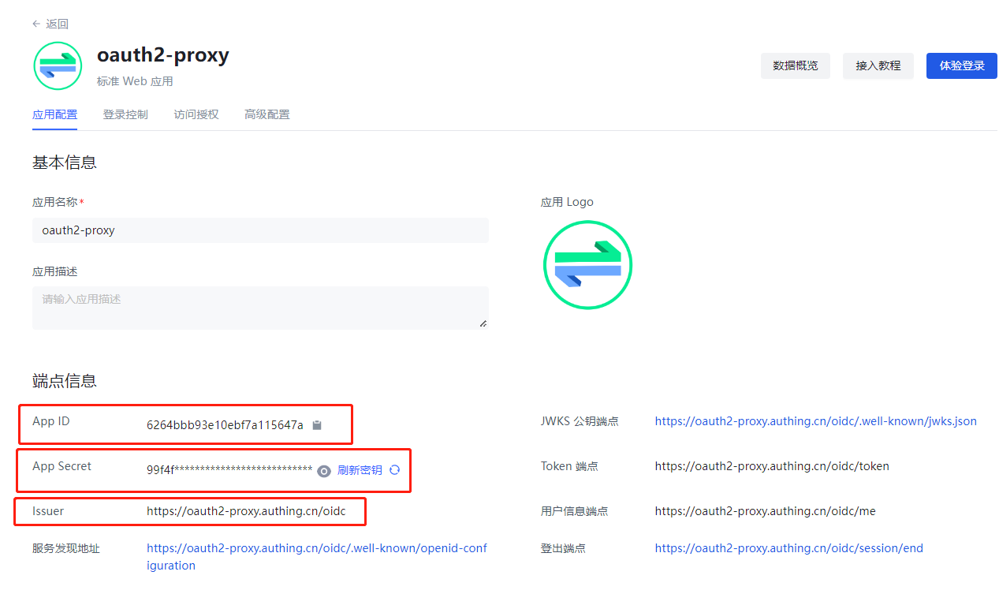
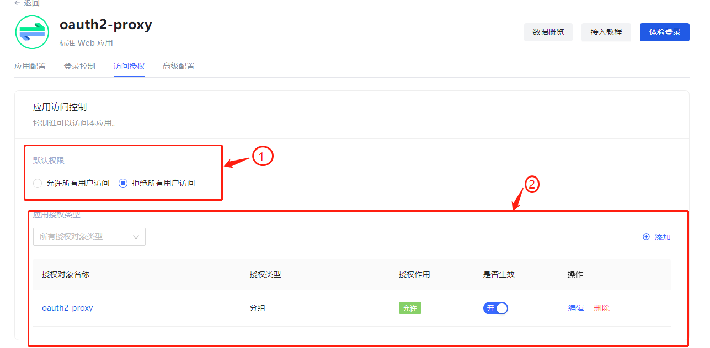

## Oauth2-proxy 接入Authing 平台

[oauth2-proxy 项目说明文档](https://github.com/opensourceways/oauth2-proxy#readme)

### oauth2-proxy 服务端配置

#### 配置文件方式例子：

```ini
http_address="0.0.0.0:30008"
cookie_secret="OQINaROshtE9TcZkNAm-5Zs2Pv3xaWytBmc5W7sPX7w="
provider="oidc"
provider_display_name="authing"
client_id="6264bbb9****f7a115647a"
client_secret="99f4fa5*****47299a018e7c7d0"
email_domains="*"
insecure_oidc_allow_unverified_email=true
redirect_url="http://119.8.126.102:30008/oauth2/callback"
oidc_issuer_url="https://oauth2-proxy.authing.cn/oidc"
upstreams=["http://127.0.0.1:9700/"]
session_cookie_minimal=false
pass_access_token = true
cookie_secure="false"
```

[所有配置项说明文档](https://oauth2-proxy.github.io/oauth2-proxy/docs/configuration/overview)

**当使用命令行参数配置时将下划线改成中划线即可：**
如：oidc_issuer_url <-----> oidc-issuer-url

#### 修改或新增的配置项说明：

- provider:  请设置为 oidc
- provider_display_name：oauth2 授权页展示的授权平台名字
- client_id ：authing 平台应用对应的 APP ID
- client_secret：authing 平台应用对应的 APP secret
- insecure_oidc_allow_unverified_email：允许未验证的邮箱登录 默认值 false
- redirect_url：oauth2-proxy 授权回调地址
- oidc_issuer_url：authing 平台应用对应的 issuer 端点信息

以上说明 authing 应用对应的信息见下图：



### authing 应用授权配置

oauth2-proxy 依赖authing 平台的授权管理，所以需要对应用进行授权访问配置

进入应用详情，点击访问授权选项卡：



- step 1 : 关闭默认允许所有用户访问的权限
- step 2 : 添加应用授权对象，此处可以根据授权对象添类型添加不同的对象，详情可参考 authing 文档

配置完成后只有授权对象列表中分组、用户、组织机构中的成员可以通过该应用的授权。
